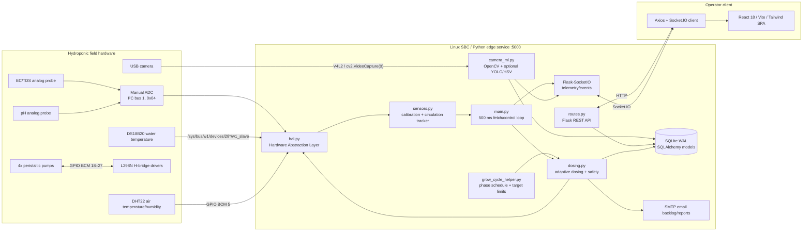
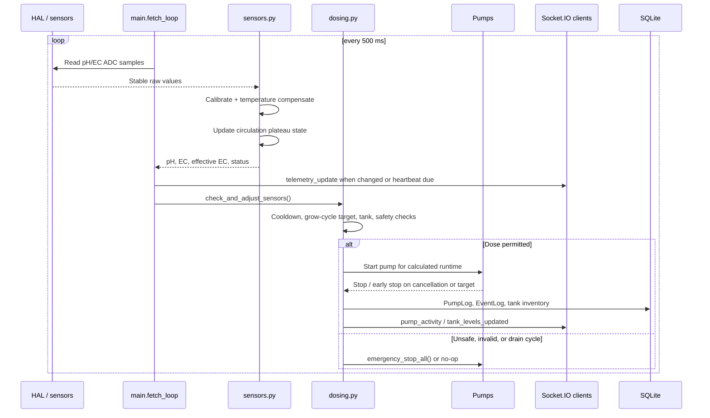

# Prana 1 Architecture Map

**Repository basis:** current working tree of `hydroagrix-ai-dosing-controller`  
**System name used by the repository:** Prana 1 / Hydroagrix Automated Smart Dosing & Nutrient Controller  
**Deployment target:** Raspberry Pi / Seeed reTerminal Linux SBC  
**Map scope:** implemented repository interfaces, runtime flows, and documented gaps

## 1. Executive architecture

Prana 1 is an edge-hosted, closed-loop hydroponics controller. The Python service runs directly on the Linux SBC and owns hardware access, sensor calibration, dosing decisions, camera capture/inference, persistence, REST APIs, and Socket.IO events. The React application is the operator interface.

There is no separate firmware project or microcontroller protocol in this repository. The hardware boundary is implemented by `backend/hal.py` using Linux GPIO, I²C, 1-Wire sysfs, and V4L2 camera access.

## 2. Layer and responsibility map

| Layer | Main implementation | Responsibility | Boundary exposed |
|---|---|---|---|
| Hardware access / “firmware interface” | `backend/hal.py` | Read ADC, DS18B20, DHT22; start/stop pumps; fail-safe initialization and emergency stop | Linux I²C, GPIO, 1-Wire sysfs; no MCU serial/MQTT protocol |
| Sensor processing | `backend/sensors.py` | Stable ADC sampling, pH/EC calibration, temperature compensation, live buffers, flood-and-drain/RO detection | Python calls from `main.py`; calibrated values in telemetry and DB |
| Control and dosing | `backend/dosing.py` | Safety gates, target delta calculation, pump runtime, cooldown, tank inventory, post-dose self-tuning | Calls HAL; writes logs/tanks; emits pump events |
| Crop schedule | `backend/grow_cycle_helper.py` | Preset stage progression and pH/EC target limits; reconciles vision as informational | Used by dosing and REST/UI |
| AI / vision | `backend/camera_ml.py` | Camera stream, daily plant-stage detection, image capture, timelapse generation | Optional `stage_detect.pt` YOLO model; HSV fallback; Socket.IO frames |
| Backend service | `backend/main.py`, `backend/routes.py`, `backend/config.py` | Background loops, Flask API, Socket.IO server, startup/shutdown | HTTP/REST on port 5000; Socket.IO; SMTP; SQLite |
| Persistence | `backend/models.py`, `backend/db_cache.py` | Sensor history, events, pump logs, grow cycles, presets, tank inventory, email queue | SQLite in Flask instance path; WAL mode |
| Frontend | `frontend/src/` | Dashboard, pump controls, camera view, presets, settings, history | Axios REST calls and singleton Socket.IO connection |
| Deployment/runtime | `systemd/`, `start_reterminal.sh`, `deploy_*.ps1` | Process supervision, build, SCP/SSH deployment, DB initialization | Linux systemd; Windows PowerShell deployment workstation |

## 3. Hardware interfaces

### Inputs

| Device | Physical/software interface | Code path | Data path |
|---|---|---|---|
| EC/TDS analog probe | Manual ADC, I²C bus 1, address `0x04`, channel `0` | `hal.ManualADC`, `hal.EC_CHANNEL` | raw ADC → `apply_ec_calibration()` → circulation tracker → telemetry/dosing |
| pH analog probe | Same ADC, channel `2` | `hal.PH_CHANNEL` | raw ADC → piecewise calibration + temperature compensation → telemetry/dosing |
| DS18B20 | Linux 1-Wire sysfs `/sys/bus/w1/devices/28*/w1_slave` | `hal._get_water_temp()`, `_poll_slow_sensors()` | cached water temperature; fallback estimate if unavailable |
| DHT22 | GPIO BCM `5`, Seeed DHT library | `hal.dht_sensor`, `get_climate()` | cached air temperature/humidity every 2 seconds |
| USB camera | V4L2 device index `0` via OpenCV | `camera_ml.camera_worker()`, `capture_single_frame()` | JPEG/base64 stream; stored stills; stage inference |

### Outputs

| Actuator | Driver/interface | Mapping | Safety behavior |
|---|---|---|---|
| Pump 1 / Nutrient A | L298N H-bridge, GPIO output pair | BCM `18/19` | LOW on boot/stop; permission checked before start |
| Pump 2 / Nutrient B | L298N H-bridge, GPIO output pair | BCM `22/23` | Same |
| Pump 3 / pH UP | L298N H-bridge, GPIO output pair | BCM `24/25` | Same |
| Pump 4 / pH DOWN | L298N H-bridge, GPIO output pair | BCM `26/27` | Same |

The implementation uses GPIO direction pairs; the `en` field exists in the pin map but is `None` for all four pumps. There is no PWM speed-control or flow-meter feedback interface in the active HAL. Flow is modeled from configured mL/s values and elapsed runtime.

## 4. Runtime data and control flows

### Telemetry and dosing loop

Important rates and state:

- `main.fetch_loop()` executes every 0.5 seconds.
- HAL slow sensors are refreshed every 2 seconds in a daemon thread.
- Telemetry is emitted on value/state changes or at a 5-second heartbeat; the loop itself is not a guaranteed 2 Hz network stream.
- Historical pH/EC/climate records are aggregated every 10 minutes.
- Dosing has a default 15-minute cooldown and uses a 0.1-second stop-check loop while a pump is running.
- Safety gates stop all pumps for invalid pH/EC, EC at or above `8.0`, or tank permission failures; the controller also sends debounced email alerts.

### Camera and AI flow

1. `/start_stream` enables the camera worker.
2. `camera_worker()` opens camera index `0`, captures frames, JPEG-encodes them, and emits `camera_frame` over Socket.IO.
3. `detect_plant_stage()` saves a still and tries YOLO if `ultralytics` is installed and `stage_detect.pt` exists at the runtime model path.
4. Without a usable YOLO model, HSV green-pixel coverage classifies `Seedling`, `Vegetative`, or `Flowering`.
5. The detected stage is persisted in `PlantStageStatus` and sent in `grow_cycle_update`.
6. `grow_cycle_helper.py` keeps the scheduled crop phase as the dosing authority; vision is informational/reconciliation input.

## 5. Software interfaces

### REST/API surface

The primary interface groups are:

- Monitoring: `/api/live_gauges`, `/api/system_health`, `/api/circulation_status`, `/sensor_status`.
- Sensors/history: `/get_ph`, `/get_tds`, `/get_temperature_humidity`, history endpoints, `/sensor/limits`.
- Actuation: `/pump/<id>/start`, `/pump/<id>/stop`, `/pump/all/start`, `/pump/all/stop`, `/api/pumps/prime`.
- Grow cycles: `/get_grow_cycle_status`, `/set_active_plant`, `/update_plant_status`, `/api/cycle/new`, `/api/grow_cycle/change_phase`, `/complete_cycle`.
- Presets/configuration: `/api/presets`, `/api/dosing_config`, `/get_system_config`, `/update_system_config`, email configuration endpoints.
- Camera/reports: `/start_stream`, `/stop_stream`, `/get_latest_photo`, `/generate_timelapse`, `/get_timelapse`, `/send_report_email`, CSV/PDF download endpoints.

### Socket.IO events

Server-originated events emitted by the current backend are:

| Event | Purpose |
|---|---|
| `telemetry_update` | pH, EC, effective EC, temperature, humidity, drain/plateau state, pump states |
| `camera_frame` | Base64 JPEG live camera frame |
| `grow_cycle_update` | Active plant, scheduled phase, target limits, cycle details |
| `pump_status_update` | Current state of each pump |
| `pump_activity` | Pump execution and trigger type |
| `tank_levels_updated` | Updated dosing-solution inventory |
| `sensor_limits_updated`, `limits_updated` | Updated sensor limits |

### Frontend connection

- `frontend/src/main.jsx` sets Axios base URL to `http://<current-host>:5000`.
- `frontend/src/socket.js` creates the singleton Socket.IO client.
- Vite development configuration proxies REST and `/socket.io` to `localhost:5000`.
- Frontend routes cover dashboard, camera, pump control, plant presets, settings, sensor views, and history.

## 6. Persistence and ownership

`backend/models.py` defines the persistent data boundary. The main model groups are:

- Telemetry: `PHData`, `TDSData`, `TemperatureHumidityData`, `MoistureSensorData`.
- Operations/audit: `PumpLog`, `EventLog`, `EmailAuditLog`, `EmailBacklog`.
- Crop configuration: `PlantStageStatus`, `PlantPreset`, `PresetAuditLog`.
- Dosing inventory/configuration: `SolutionTanks`, `SensorLimits`.
- Vision artifacts: `PhotoRecord`; image files live in `captured_photos/`.

SQLite is configured in WAL mode by `backend/config.py`. Runtime configuration is also held in JSON files such as `system_config.json`, `email_config.json`, and the calibration JSON files under `tools/config/`. The dosing configuration writer uses a temporary file and `os.replace()` for an atomic swap.

## 7. Firmware, AI, backend, and hardware interface assessment

### Firmware

No standalone firmware source, firmware image, embedded build, serial protocol, MQTT client, or Modbus interface was found. The repository has no `.ino`, C/C++, header, or firmware-binary artifacts. `backend/grove/` and `backend/Seeed_Python_DHT/` are Python driver/library code, not device firmware.

Therefore the effective “firmware interface” is:

`Python control logic → HAL → Linux device interfaces → physical electronics`

This means Linux scheduling, Python process health, GPIO initialization, and the H-bridge electrical design are part of the control-safety boundary. A future MCU/firmware split would be a significant architectural change, not a currently documented interface.

### AI

The implemented AI boundary is local computer vision only. It is optional, model-file dependent, and advisory to dosing. No external AI API, cloud inference service, plant database, or training pipeline is present. The `PhotoRecord.google_drive_link` field currently stores the local file path produced by `camera_ml.py`; it does not demonstrate an active Google Drive integration.

### Backend

The backend is a single Flask/Socket.IO process with in-process background tasks. It is not decomposed into separate sensor, control, AI, or API services. All of those components share Python globals, the SQLAlchemy session, filesystem configuration, and the same process lifecycle.

### Hardware

The active hardware contract is tightly coupled to the documented pin/channel/address assignments in `backend/hal.py`. A missing hardware library causes stub mode, allowing tests/local development to run, but does not emulate real sensor values or validate physical electrical behavior.

## 8. Verification notes and risks for the report

These are repository-observed caveats, not assumptions:

1. `backend/hal.py` samples 25 ADC values and trims 5 from each end; `DOCUMENTATION.md` says 50 samples and trims 10. The code and documentation are out of sync.
2. `camera_ml.py` expects `stage_detect.pt`, but no such model file is present in the repository. A clean checkout will normally use the HSV fallback unless the model is provisioned separately on the target.
3. `backend/routes.py` reads `hal.is_hardware_available`, while `backend/hal.py` defines `HARDWARE_AVAILABLE`. The system-health response may therefore report hardware as unavailable even when the HAL is active.
4. The systemd frontend unit runs `npm run dev` with `NODE_ENV=development`, while `start_reterminal.sh` uses `npm run preview` and the deployment script builds `frontend/dist`. The production serving model needs one authoritative deployment path.
5. `backend/config.py` enables wildcard CORS and the service binds to `0.0.0.0`; the repository does not show authentication or authorization around pump-control endpoints. This is a security boundary for any network-exposed deployment.
6. The code contains a large vendored Grove driver library, but only the ADC, DHT22, GPIO pump, DS18B20, and OpenCV camera paths are wired into the active Prana 1 runtime.

## 9. Primary source files

- [README.md](README.md) — product overview and intended architecture.
- [DOCUMENTATION.md](DOCUMENTATION.md) — onboarding, API, hardware, dosing, and deployment documentation.
- [backend/hal.py](backend/hal.py) — direct hardware interface.
- [backend/sensors.py](backend/sensors.py) — calibration and telemetry processing.
- [backend/dosing.py](backend/dosing.py) — control loop decision logic and pump execution.
- [backend/camera_ml.py](backend/camera_ml.py) — camera, inference, and image pipeline.
- [backend/main.py](backend/main.py) — service startup and background loops.
- [backend/routes.py](backend/routes.py) — HTTP interface.
- [backend/models.py](backend/models.py) — persistence schema.
- [frontend/src/](frontend/src/) — operator UI and client interfaces.
- [systemd/](systemd/) and [start_reterminal.sh](start_reterminal.sh) — runtime launch configuration.
