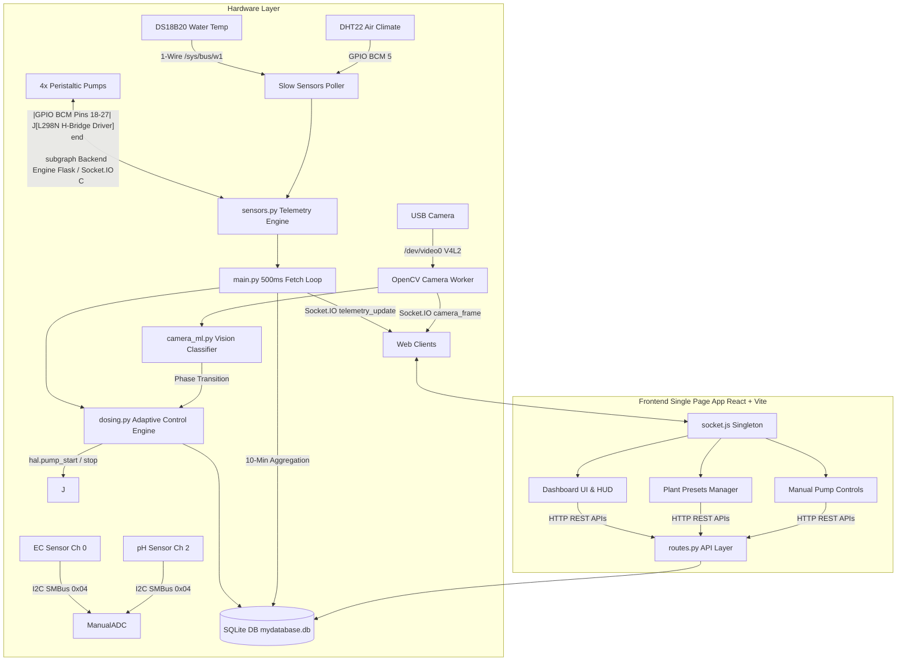

# Hydroagrix AI Dosing Controller - Complete System Documentation

> **Complete Onboarding & Reference Guide for Incoming Developers**  
> **Last Updated:** August 2026  
> **Repository:** `CyberShadowSensei/hydroagrix-ai-dosing-controller`  
> **System Status:** Production Ready & Verified (221 Automated Tests Passing: 195 Backend Pytest + 26 Frontend Vitest)


---

## Table of Contents

1. [System Overview & High-Level Architecture](#1-system-overview--high-level-architecture)
2. [Hardware & Firmware Abstraction Layer (HAL)](#2-hardware--firmware-abstraction-layer-hal)
3. [Backend Architecture (Python / Flask / Socket.IO)](#3-backend-architecture-python--flask--socketio)
4. [Frontend Architecture (React / Vite / Tailwind)](#4-frontend-architecture-react--vite--tailwind)
5. [Database Schema, Persistence & Diagnostics](#5-database-schema-persistence--diagnostics)
6. [Dosing Algorithm & Crop Stage Machine Learning](#6-dosing-algorithm--crop-stage-machine-learning)
7. [APIs, WebSockets & Event Reference](#7-apis-websockets--event-reference)
8. [Developer Setup, Testing & Deployment](#8-developer-setup-testing--deployment)
9. [License & Legal Terms](#9-license--legal-terms)

---

## 1. System Overview & High-Level Architecture

The **Hydroagrix AI Dosing Controller** is an automated, closed-loop hydroponic nutrient and pH management platform engineered for Raspberry Pi / Seeed reTerminal embedded hardware. 

The system operates in two primary modes:
- **Autonomous Mode**: The system monitors pH and Electrical Conductivity (EC / TDS) and automatically drives 4 peristaltic pumps to maintain target chemical ranges defined by crop growth presets. The scheduled grow cycle progression dictates active dosing limits and phase transitions, while an edge vision model periodically analyzes leaf coverage to classify growth stages for informational monitoring.
- **Manual Mode**: Dosing is governed by user-configured static sensor limits set via the web dashboard, while tracking growth timelines in the background.

### Architecture Map



---

## 2. Hardware & Firmware Abstraction Layer (HAL)

All physical hardware interactions are encapsulated within [`backend/hal.py`](file:///E:/Hydroagrix%20Ai/Ai%20Dosing%20Unit/backend/hal.py). On non-Raspberry Pi environments, HAL falls back to stub mode gracefully.

### 2.1 Analog Sensing (I2C SMBus)
- **ADC Address**: `0x04` on I2C Bus 1 via custom `ManualADC` class.
- **Channel 0**: EC (TDS) Sensor.
- **Channel 2**: pH Sensor.
- **Outlier Rejection**: `get_stable_reading(channel)` collects 50 rapid ADC samples, discards top 10 and bottom 10 outliers, and returns the arithmetic mean.

### 2.2 Peristaltic Pump Drivers (L298N H-Bridge via RPi.GPIO BCM)
- **Pump 1 (Nutrient A)**: IN1 = `GPIO 18`, IN2 = `GPIO 19`
- **Pump 2 (Nutrient B)**: IN1 = `GPIO 22`, IN2 = `GPIO 23`
- **Pump 3 (pH UP)**: IN1 = `GPIO 24`, IN2 = `GPIO 25`
- **Pump 4 (pH DOWN)**: IN1 = `GPIO 26`, IN2 = `GPIO 27`
- **Safety Lock**: All pump state mutations are thread-protected by `hal.pump_lock` (Reentrant Lock).
- **Failsafe**: `initialize_hardware()` forces all pump pins LOW on boot to prevent runaway dosing during system restarts.

### 2.3 Environmental Sensors
- **Water Temperature**: DS18B20 1-Wire thermal probe at `/sys/bus/w1/devices/28*/w1_slave`.
- **Air Temperature & Humidity**: DHT22 sensor connected to `GPIO BCM 5`.
- **Non-Blocking Cache**: `_poll_slow_sensors()` runs in a dedicated background daemon thread updating cached readings every 2.0 seconds.

---

## 3. Backend Architecture (Python / Flask / Socket.IO)

The backend is built using Flask, Flask-SocketIO, and SQLAlchemy running on Python 3.10.

### 3.1 Core Daemons & Threads (`backend/main.py`)
1. **`fetch_loop`** (500ms): Reads sensors, applies temperature compensation and calibration formulas, emits live `telemetry_update` Socket.IO events, and triggers `check_and_adjust_sensors()`.
2. **`aggregation_loop`** (10 minutes): Averages in-memory telemetry buffers (`live_ph_data`, `live_tds_data`, `live_th_data`) and commits 10-minute historical records to SQLite.
3. **`daily_digest_loop`** (30s check, triggered at 02:00 AM / 08:00 AM IST):
   - **02:00 AM**: Generates daily timelapse video, prunes database logs older than 30 days, and deletes photo JPEGs older than 30 days (`prune_old_photos`).
   - **08:00 AM**: Generates and emails the daily agricultural digest report.
4. **`process_email_backlog_items`** (60s loop): Processes pending emails in `EmailBacklog`. Connection errors break the loop to retry later, while un-deliverable recipient errors skip/delete the item to prevent queue stalls.
5. **`camera_worker`**: Single-instance background task capturing USB camera frames (`/dev/video0`) at ~20 fps, encoding JPEGs, and streaming base64 frames over Socket.IO when web clients request live video.

### 3.2 Key Backend Modules
- **`routes.py`**: Declares all REST API endpoints (`/sensor/limits`, `/pump/<id>/start`, `/set_active_plant`, etc.).
- **`sensors.py`**: Manages piecewise linear calibration for pH (`ph_calibration.json`) and EC (`ec_calibration.json`) with Nernst temperature compensation.
- **`grow_cycle_helper.py`**: Single source of truth for calculating crop cycle progression day, active phase, next phase transition, and active target limits.

---

## 4. Frontend Architecture (React / Vite / Tailwind)

The frontend is a modern Single Page Application (SPA) built with React, Vite, and TailwindCSS located in `frontend/`.

### 4.1 Main Structure & State
- **`main.jsx` & `App.jsx`**: Main application shell with dynamic tab navigation.
- **`socket.js`**: Exports a single, singleton Socket.IO connection instance (`io(socketUrl)`) to prevent socket flooding.
- **`Dashboard.jsx`**: Main monitoring view containing live parameter gauges, grow cycle banners, manual pump widgets, and live video stream.
- **`PlantPresets.jsx`**: Plant crop manager allowing users to select preset crops (Tomatoes, Lettuce, Basil, etc.), modify phase schedules, or create custom presets.
- **`Settings.jsx`**: System configuration panel for reservoir volumes, pump flow rates, email alert targets, and sensor limits.
- **`History.jsx`**: Interactive historical charting for pH, EC, water/air temperature, and pump runtime logs.

---

## 5. Database Schema & Data Persistence

SQLite database located at `backend/instance/mydatabase.db` managed via Flask-SQLAlchemy. SQLite WAL (Write-Ahead Logging) mode is initialized on startup.

```mermaid
erDiagram
    PlantStageStatus {
        int id PK
        string plant_name
        string plant_stage
        boolean state
        datetime cycle_start_date
    }
    PlantPreset {
        int id PK
        string name
        string image_url
        text stages_json
    }
    SensorLimits {
        int id PK
        string sensor_type
        float min_value
        float max_value
        boolean is_active
    }
    PHData {
        int id PK
        float ph_value
        float water_temp
        float air_temp
        datetime timestamp
        boolean archived
    }
    TDSData {
        int id PK
        float tds_value
        float water_temp
        float air_temp
        datetime date
        boolean archived
    }
    PumpLog {
        int id PK
        string pump_name
        int duration
        string trigger_type
        datetime timestamp
    }
    SolutionTanks {
        int id PK
        int tank_id
        string name
        float capacity_ml
        float current_volume_ml
        float last_alert_sent
    }
    EmailBacklog {
        int id PK
        string subject
        text body_text
        text body_html
        string recipients
        datetime created_at
    }
```



### 5.1 Atomic Persistence Helper
To prevent zero-byte file corruption during unexpected power outages, configuration updates to `system_config.json` use `dosing.save_system_config()`:
1. Data is written to `system_config.json.tmp`.
2. `os.replace("system_config.json.tmp", "system_config.json")` performs an atomic filesystem swap.

### 5.2 Database Diagnostic & Verification Utility (`~/hydro-db-check.sh`)
The system includes a target database diagnostic script located at `~/hydro-db-check.sh` on the reTerminal / Raspberry Pi hardware.

- **Purpose**: Quick command-line verification of SQLite database integrity, journal mode, row counts across all models, active grow cycle state, configured sensor limits, and recent warning/danger event logs.
- **Execution**:
  ```bash
  chmod +x ~/hydro-db-check.sh
  ~/hydro-db-check.sh
  ```
- **Output Provided**:
  1. **SQLite Quick Check & Journal Mode**: Verifies SQLite database file health (`PRAGMA quick_check;`) and WAL mode.
  2. **Model Table Counts**: Row counts for `PlantStageStatus`, `PlantPreset`, `SensorLimits`, `PHData`, `TDSData`, `PumpLog`, `EventLog`, and `EmailAuditLog`.
  3. **Active Grow Cycle Summary**: Active plant name, stage, mode (`state`), and start date.
  4. **Active Sensor Limits**: Range bounds and active state (`is_active`) per sensor type.
  5. **Recent Danger & Warning Logs**: Displays the 5 most recent `WARNING` and `DANGER` entries from `event_log`.
  6. **Recent Pump Execution Logs**: Displays the 5 most recent dosing pump operations from `pump_log`.

---

## 6. Dosing Algorithm & Crop Stage Machine Learning

### 6.1 Dosing Execution Flow (`backend/dosing.py`)
```
1. check_and_adjust_sensors() triggered every 500ms
2. Check Cooldown Timer (default: 15 minutes between dosing cycles)
3. Check Safety Bounds:
   - If pH < 3.0 or > 10.0 OR EC >= 8.0 mS/cm: Trigger EMERGENCY HALT, stop all pumps, send DANGER email.
4. Calculate Required Dose Volume:
   - Volume (mL) = Delta * Reservoir_Volume_L * Nutrient_Factor (mL/L/EC)
   - Runtime (sec) = Volume (mL) / Pump_Flow_Rate (mL/sec)
   - Enforce Min Runtime (min_dose_time_sec = 2.0s) & Max Ceiling (max_dose_time_sec = 300.0s)
5. Run Pumps safely (_safe_pump_run):
   - Poll cancel_dosing_flag every 0.1s. If operator presses manual stop, pump halts instantly (<100ms).
6. Auto-Self-Calibration (_evaluate_last_dose):
   - After cooldown, compare actual sensor delta vs predicted delta and adjust dosing factors automatically.
```

### 6.2 Computer Vision Crop Stage Classifier (`backend/camera_ml.py`)
- Every 24 hours, `plant_monitor_thread` captures a frame from the USB camera.
- Computes the green leaf pixel ratio using the YOLO stage classifier or HSV color space fallback.
- The detected stage is saved to the database and broadcasted as informational metadata (`ml_info` / `ml_stage`) over Socket.IO, while the scheduled grow cycle timeline retains strict precedence for active dosing limits.

---

## 7. APIs, WebSockets & Event Reference

### 7.1 Key REST Endpoints

| Endpoint | Method | Description |
| :--- | :--- | :--- |
| `/api/live_gauges` | `GET` | Returns latest pH, EC, temperature, and humidity gauge readings. |
| `/sensor/limits` | `GET` | Returns static sensor limits merged with active autonomous crop stage limits. |
| `/pump/<id>/start` | `POST` | Starts specified pump (`1`-`4`) for duration. Payload: `{"duration": 5}`. |
| `/pump/<id>/stop` | `POST` | Halts specified pump instantly and cancels active auto-dosing loops. |
| `/pump/all/stop` | `POST` | Emergency manual halt for all 4 peristaltic pumps. |
| `/update_plant_status` | `POST` | Toggles system mode (`state: true` for Autonomous, `state: false` for Manual). |
| `/set_active_plant` | `POST` | Starts a new growth cycle for named preset. Payload: `{"plant_name": "Tomatoes"}`. |
| `/complete_cycle` | `POST` | Completes active growth cycle and triggers background report generation. |
| `/api/pumps/prime` | `POST` | Primes nutrient pumps 1 & 2 for 5 seconds in a background thread. |

### 7.2 Socket.IO Events

| Event Name | Direction | Payload Description |
| :--- | :--- | :--- |
| `telemetry_update` | Server $\rightarrow$ Client | Live sensor readings (`ph`, `ec`, `temperature`, `humidity`). |
| `camera_frame` | Server $\rightarrow$ Client | Base64-encoded JPEG image string from USB camera feed. |
| `grow_cycle_update` | Server $\rightarrow$ Client | Full growth cycle progression details, day count, phase, and target limits. |

---

## 8. Developer Setup, Testing & Deployment

### 8.1 Local Environment Setup
```bash
# 1. Clone repository
git clone https://github.com/CyberShadowSensei/hydroagrix-ai-dosing-controller.git
cd hydroagrix-ai-dosing-controller

# 2. Setup Backend
cd backend
python -m venv venv
# On Windows: venv\Scripts\activate  | On Linux: source venv/bin/activate
pip install -r requirements.txt

# 3. Setup Frontend
cd ../frontend
npm install
```

### 8.2 Running the Full Automated Test Suite
```bash
# Run backend pytest suite (195 unit, edge-case, integration & stress tests)
cd backend
python -m pytest -v --tb=short -p no:cacheprovider

# Run frontend Vitest suite (26 React component & HUD tests)
cd ../frontend
npm test
```

### 8.3 Hardware Deployment (reTerminal / Raspberry Pi)
Automated target deployment is managed via [`deploy_full.ps1`](file:///E:/Hydroagrix%20Ai/Ai%20Dosing%20Unit/deploy_full.ps1) (full application release) and [`deploy_quick.ps1`](file:///E:/Hydroagrix%20Ai/Ai%20Dosing%20Unit/deploy_quick.ps1) (fast backend hot-patch).

Services are managed on the Linux target using `systemd`:
```bash
# Restart services on reTerminal
sudo systemctl restart hydro-backend.service hydro-frontend.service

# View live backend logs
sudo journalctl -u hydro-backend.service -f

# Run SQLite Database Diagnostics
~/hydro-db-check.sh
```

---

## 9. License & Legal Terms

Copyright (c) 2026 Hydroagrix AI / CyberShadowSensei. All Rights Reserved.

PROPRIETARY AND CONFIDENTIAL.

Unauthorized copying, reproduction, distribution, modification, sublicensing, or use of this software and associated documentation, via any medium or in any form, is strictly prohibited. See `LICENSE` for full terms.
