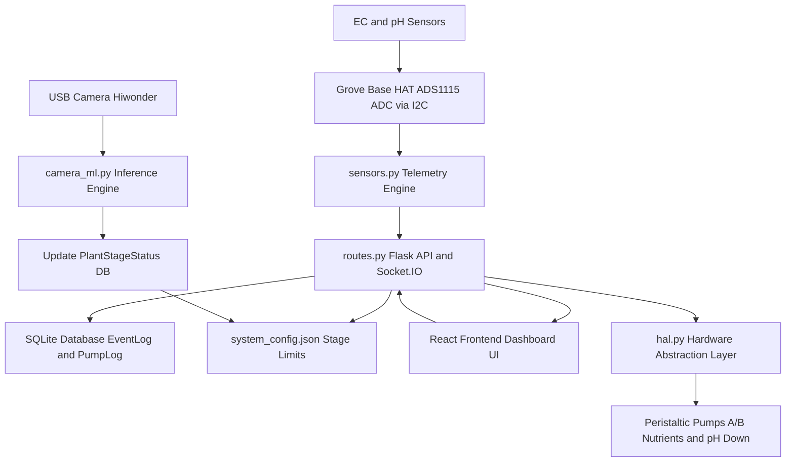

# Hydroagrix AI Dosing Controller

> The comprehensive hardware automation, sensing, and control platform for the Hydroagrix hydroponic NFT system, featuring automatic dosing logic and a real-time web dashboard.

## System Architecture and Data Flow



## Features
* **Real-Time Telemetry:** Continuous, high-frequency monitoring of pH, Electrical Conductivity (EC), water temperature, and ambient environmental parameters via I2C ADCs.
* **Automated Dosing Loop:** Intelligent, feedback-driven peristaltic pump control logic. The system automatically calculates and dispenses precise nutrient volumes to maintain optimal tank concentrations.
* **Vision Integration:** Seamlessly interfaces with the edge vision pipeline to dynamically adjust dosing limits based on the detected plant growth stage.
* **Web Dashboard:** A responsive, modern React-based frontend providing real-time graphs, historical logging, manual hardware overrides, and system configuration capabilities.
* **Robust Logging:** Full SQLite-backed event and pump logging system ensuring all automated actions are auditable and traceable.

## Prerequisites
* Node.js v18+ (for compiling and serving the Frontend Dashboard)
* Python 3.10+ (for the Flask Backend and Hardware Abstraction Layer)
* Raspberry Pi (or similar Linux-based SBC) with I2C interfaces enabled
* systemd (for managing backend and frontend daemons)
* Docker (Optional, for containerized deployments)

## Installation
1. Clone the repository:
   ```bash
   git clone https://github.com/CyberShadowSensei/hydroagrix-ai-dosing-controller.git
   ```
2. Navigate to the project directory:
   ```bash
   cd hydroagrix-ai-dosing-controller
   ```
3. Install backend dependencies (Flask, SQLAlchemy, smbus2):
   ```bash
   cd backend
   pip install -r requirements.txt
   ```
4. Install frontend dependencies (React, Chart.js, Socket.IO):
   ```bash
   cd ../frontend
   npm install
   ```

## Usage
```bash
# Restart both the backend and frontend systemd services on the reTerminal
sudo systemctl restart hydro-backend.service hydro-frontend.service

# View live telemetry and dosing logs via the journal
sudo journalctl -u hydro-backend.service -f
```

## Configuration
* **I2C_ADDR:** Hexadecimal address of the Grove Base HAT ADC on the I2C bus (default: `0x48`).
* **TARGET_PH:** The ideal pH level target for the dosing algorithm (configurable via dashboard, default: `6.0`).
* **TARGET_EC:** The ideal Electrical Conductivity target in mS/cm (configurable via dashboard, default: `1.2`).
* **PUMP_CALIBRATION_ML_PER_SEC:** Calibrated flow rate for the peristaltic pumps (default: `1.5` ml/s).

## Contributing
1. Fork the Project
2. Create your Feature Branch (`git checkout -b feature/NewSensorIntegration`)
3. Commit your Changes (`git commit -m 'Add support for Atlas Scientific sensors'`)
4. Push to the Branch (`git push origin feature/NewSensorIntegration`)
5. Open a Pull Request for review

## License
Distributed under the MIT License. See `LICENSE` for more information.
