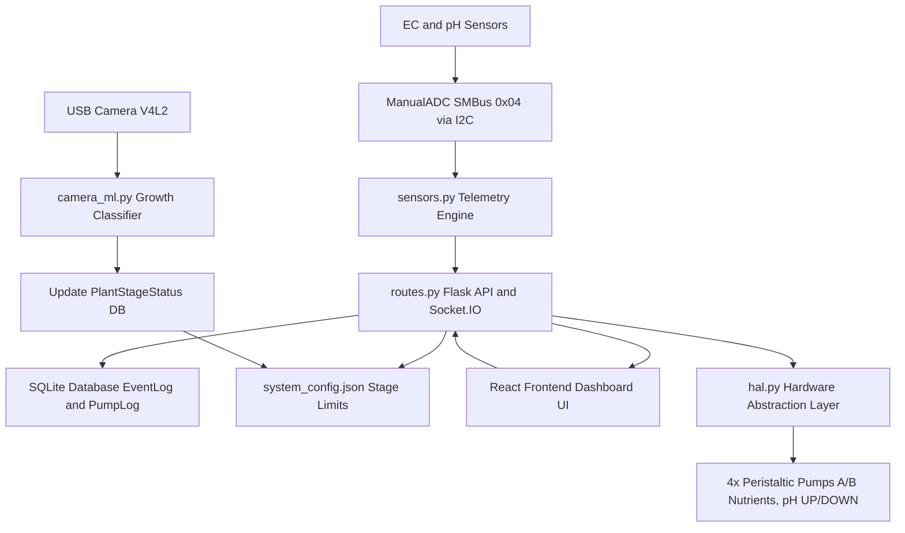

# Hydroagrix AI Dosing Controller

> The comprehensive hardware automation, sensing, and control platform for the Hydroagrix hydroponic NFT system, featuring closed-loop automatic dosing logic, computer vision crop monitoring, and a real-time web dashboard.

> **Note**: Complete developer onboarding, system architecture, API references, and hardware schemas are documented in [`DOCUMENTATION.md`](file:///E:/Hydroagrix%20Ai/Ai%20Dosing%20Unit/DOCUMENTATION.md).

---

## System Architecture and Data Flow



---

## Complete Features

* **Closed-Loop Automated Dosing:** Intelligent, feedback-driven peristaltic pump control logic. The system automatically calculates target chemical deltas, reservoir volumes (L), and calibrated pump flow rates (mL/s) to dispense precise nutrient and pH adjustments.
* **Piecewise Sensor Calibration & Nernst Compensation:** Advanced multi-point linear interpolation for EC and pH sensor probes, incorporating Nernst temperature compensation via DS18B20 thermal readings.
* **Computer Vision Growth Classifier:** Interfaces with edge cameras (/dev/video0 V4L2) using OpenCV HSV color analysis and YOLO stage detection to classify plant growth stages (Germination, Vegetative, Flowering).
* **Real-Time WebSocket HUD:** Emits 500ms real-time telemetry updates (pH, EC, water temperature, ambient air temperature/humidity) and live base64 camera streams over Socket.IO.
* **Autonomous Grow Cycle Management:** Dynamic calculation of crop cycle day counts, active phases, schedule transitions, and automatic preset limit enforcement (Tomatoes, Lettuce, Basil, Custom).
* **Self-Calibrating Feedback Engine:** Evaluates post-dosing sensor deltas against mathematical predictions after cooldown periods to automatically adjust dosing efficacy factors.
* **Multi-Tiered Safety & Alert System:** Enforces emergency halts for critical out-of-bound readings (pH < 3.0 or > 10.0, EC >= 8.0 mS/cm), triggers debounced High-EC manual intervention email alerts, and processes asynchronous email backlogs.
* **SQLite Database Health Diagnostic:** CLI database diagnostic utility (`hydro-db-check.sh`) verifying WAL journal integrity, model table row counts, active grow cycle states, and warning/danger event logs.

---

## Deployment Files and Scripts

The repository includes pre-configured deployment tools for target Linux single-board computers (Seeed reTerminal / Raspberry Pi):

* **`deploy_full.ps1`**: Automated PowerShell script for full-stack deployment. Executes local Pytest test suite, compiles Vite frontend production bundle (`dist/`), packages application binaries, transfers via SCP, updates database schemas, and reloads systemd daemons.
* **`deploy_quick.ps1`**: Fast hot-patch deployment script for transferring modified backend modules (`routes.py`, `dosing.py`, `main.py`, `models.py`, `checkSensorMail.py`) and frontend assets in seconds.
* **`hydro-db-check.sh`**: Command-line verification tool deployed to `~/hydro-db-check.sh` on the target SBC to inspect SQLite health (`PRAGMA quick_check;`), WAL journal status, table row counts, active grow cycles, and recent alert logs.
* **`start_reterminal.sh`**: Startup and environment setup script for reTerminal hardware.
* **`systemd/hydro-backend.service`**: Systemd unit configuration file for managing the Flask/Socket.IO backend service.
* **`systemd/hydro-frontend.service`**: Systemd unit configuration file for serving the React frontend.

---

## Test Features and Automated Test Suite

The system features 221 total passing automated tests across the backend and frontend layers:

### Backend Test Suite (195 Tests)
* **HAL Hardware Abstraction Tests (`test_hal.py`)**: Hardware fallback mocks, ADC channel validation, L298N pump lock reentrancy, DS18B20 1-Wire parsing, and emergency stop teardown.
* **Adaptive Control & Dosing Tests (`test_dosing.py`, `test_new_dosing.py`, `test_mid_dose_cutoff.py`)**: Volume math, min/max runtime clamping, cooldown timers, self-calibration factor evaluation, emergency halt bounds, and mid-dose safety cutoffs.
* **REST API & Route Tests (`test_api.py`, `test_api_dosing.py`, `test_api_plants.py`)**: Endpoint payload validation, pump priming, plant preset selection, cycle completion, and mode switching.
* **Grow Cycle & Models Tests (`test_grow_cycle.py`, `test_models.py`, `test_new_features.py`)**: 3-phase duration resolution, cumulative start day inference, active limit inheritance, and DB model constraints.
* **Alerts & Stress Tests (`test_alerts.py`, `test_performance_stress.py`)**: High-EC debounced intervention alerts, email backlog queue resilience, concurrent database locking under load, and background failure recovery.

### Frontend Test Suite (26 Tests)
* **UI Component & Gauge Tests (`Dashboard.test.jsx`, `GlobalHUD.test.jsx`, `QuickCameraWidget.test.jsx`)**: Real-time gauge rendering, status indicator states, camera feed fallbacks, and HUD metric displays.
* **Plant Presets & Controls Tests (`PlantPresets.test.jsx`, `PresetManagerModal.test.jsx`, `GrowCycleBanner.test.jsx`)**: Growth phase timeline visualization, preset editing forms, cycle activation banners, and pump manual override controls.

### Running Tests

```bash
# Execute Backend Pytest Suite (195 Tests)
cd backend
python -m pytest -v --tb=short -p no:cacheprovider

# Execute Frontend Vitest Suite (26 Tests)
cd frontend
npm test
```

---

## Prerequisites

* Python 3.10+ (Flask, SQLAlchemy, Flask-SocketIO, smbus2)
* Node.js v18+ (React, Vite, TailwindCSS)
* Raspberry Pi / Seeed reTerminal (Linux SBC with I2C enabled)
* systemd (for managing daemon services)

---

## Installation

1. Clone the repository:
   ```bash
   git clone https://github.com/CyberShadowSensei/hydroagrix-ai-dosing-controller.git
   cd hydroagrix-ai-dosing-controller
   ```

2. Install backend dependencies:
   ```bash
   cd backend
   pip install -r requirements.txt
   ```

3. Install frontend dependencies:
   ```bash
   cd ../frontend
   npm install
   ```

---

## Usage

```bash
# Restart backend and frontend systemd services on target device
sudo systemctl restart hydro-backend.service hydro-frontend.service

# View live telemetry logs
sudo journalctl -u hydro-backend.service -f

# Run database diagnostic check
~/hydro-db-check.sh
```

---

## License

Copyright (c) 2026 Hydroagrix AI / CyberShadowSensei. All Rights Reserved.

PROPRIETARY AND CONFIDENTIAL.

Unauthorized copying, reproduction, distribution, modification, sublicensing, or use of this software and associated documentation, via any medium or in any form, is strictly prohibited. See `LICENSE` for full terms.
