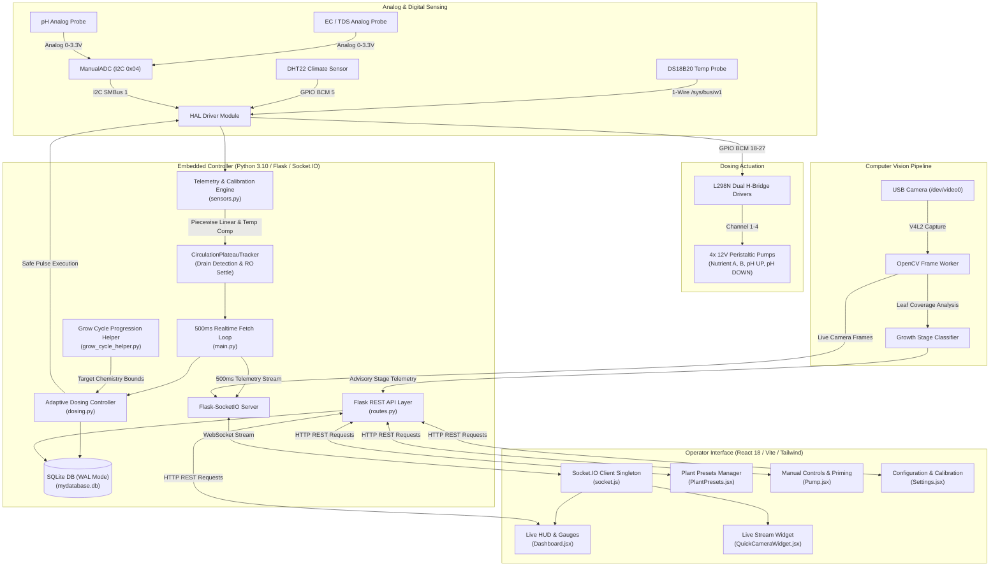
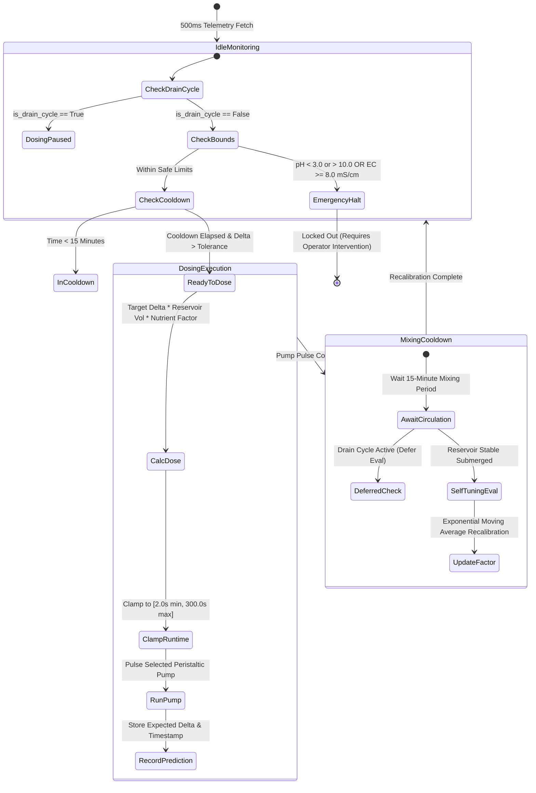
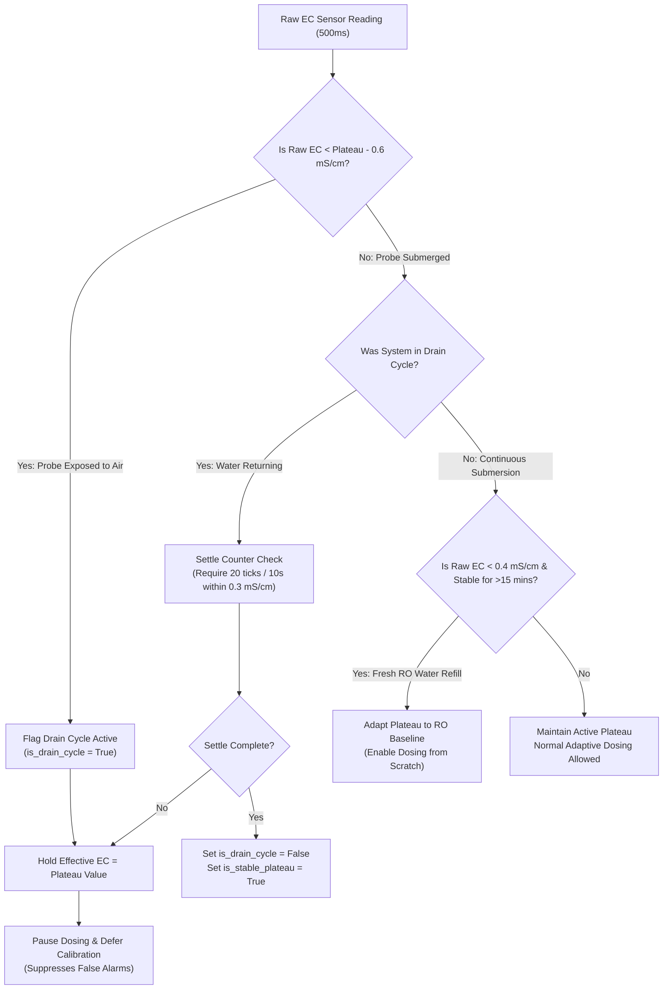

<!-- Hydroagrix Automated Smart Dosing & Nutrient Controller (Production Grade) -->
# Prana 1: The AI-Enabled Nutrient Dosing Unit

> **An autonomous, self-learning hydroponic engine engineered to eliminate human error in precision agriculture.**
> Prana 1 transforms volatile hydroponic reservoirs into stable, mathematically predictable environments using edge computer vision, closed-loop feedback algorithms, and high-frequency sensor telemetry.

> Detailed developer onboarding, architectural specs, and API endpoints are available in [`DOCUMENTATION.md`](file:///E:/Hydroagrix%20Ai/Ai%20Dosing%20Unit/DOCUMENTATION.md).

---

## The Engineering Challenge & Our Solution

In precision hydroponics, environmental volatility is the enemy. A sudden 0.5 drift in pH can instantly lock out critical nutrient absorption, stalling crop growth. Commercial analog sensors experience thermal drift, peristaltic pumps degrade over time causing unpredictable flow rates, and crops demand entirely different chemical balances depending on their real-time physiological growth stage.

**Prana 1** is designed to master these complexities at the edge:
1. **It sees the crop:** Using V4L2 USB cameras and hybrid HSV/YOLO computer vision, it classifies the exact growth stage of the plant (e.g., Vegetative vs. Flowering) and dynamically shifts the dosing targets to match the plant's immediate biological needs.
2. **It calibrates reality:** It reads raw I2C analog signals at 500ms intervals and mathematically reconstructs accurate pH and EC values, actively compensating for thermal drift using the Nernst equation and multi-point piecewise linear interpolation.
3. **It learns its own hardware:** After calculating and dispensing a precise milliliter dose, the system waits for the chemical reaction to stabilize, measures the actual sensor delta against its mathematical prediction, and automatically adjusts its internal pump efficacy models to compensate for real-world hardware wear and tear.

This is a highly fault-tolerant, self-healing control system built for the harsh realities of agricultural automation.

---

## System Architecture & Data Flow

Prana 1's architecture is organized into distinct, decoupled subsystems for telemetry, closed-loop actuation, edge intelligence, and operator interaction.

### 1. High-Level System & Edge Hardware Topology

### 2. Closed-Loop Adaptive Dosing State Machine

### 3. Flood-and-Drain Circulation Plateau Tracker Flow

---

## Core System Features

### Autonomous Dosing & Closed-Loop Control
- **Dynamic Delta Dosing Algorithm**: The core engine calculates target chemical deltas, reservoir volumes in liters, and calibrated pump flow rates in mL/s to dispense micro-precise nutrient and pH adjustments.
- **Self-Learning Calibration (Auto-Tuning)**: Evaluates actual vs. predicted sensor deltas after a strict mixing cooldown period. If a pump under-delivers due to tube wear, the system recalculates and updates the efficacy multiplier for the next run.
- **Intelligent Crop Cycle Management**: Automatically tracks crop growth timelines (Tomatoes, Lettuce, Basil, or Custom presets), managing phase transitions and shifting target chemical boundaries without human intervention.

### Circulation Plateau Tracking & RO Water Auto-Detection
- **Flood-and-Drain Resilient Tracking**: In circulating hydroponic systems where water rotates between the tank and channels, probe dry exposure causes temporary EC drops (0.3–0.5 mS/cm). The `CirculationPlateauTracker` holds the true solution plateau EC, flags drain cycles, and pauses dosing until water returns and stabilizes.
- **Fresh RO Water Fill Detection**: Seamlessly distinguishes temporary drain drops from fresh pure water refills. If a reservoir is refilled with pure RO water, the tracker identifies the flat low baseline ($\Delta < 0.05$ over 15 mins) and adapts the plateau down, allowing automated dosing from scratch.
- **Deferred Adaptive Calibration**: Automatically defers self-tuning feedback evaluation during drain dips, preventing corrupted exponential moving average factors.

### High-Precision Sensing & Edge Vision
- **Nernst Temperature Compensation**: Analog probes are notoriously sensitive to water temperature. Prana 1 applies multi-point piecewise linear interpolation and active Nernst equation compensation using DS18B20 thermal readings to guarantee laboratory-grade accuracy.
- **Edge Vision Classification**: A dedicated background pipeline captures USB camera feeds, analyzing HSV leaf coverage ratios to determine if the crop is in germination, vegetative, or flowering stages.
- **Ultra-Low Latency Telemetry**: Emits a 500ms Socket.IO sensor stream (pH, EC, water temperature, air temperature/humidity) alongside live base64 camera frames directly to the operator's web dashboard.

### Safety, Monitoring & Diagnostics
- **Sub-Second Emergency Failsafes**: The hardware abstraction layer continuously evaluates critical thresholds. If readings become dangerous (pH < 3.0 or > 10.0, EC >= 8.0 mS/cm), the system triggers an immediate emergency halt, locking out all pumps.
- **Debounced Alert Subsystem**: Dispatches automated email notifications for high EC conditions, tank depletion, and system exceptions, utilizing backoff timers to prevent alert fatigue.
- **Native Database Diagnostics**: Includes a custom CLI utility (`hydro-db-check.sh`) to inspect the integrity of the SQLite WAL journal, table row counts, and audit logs directly on the edge hardware.

---

## Deployment Scripts & Configuration Files

Deploying complex hardware-software stacks to edge devices requires precision. Prana 1 includes robust, automated deployment tooling:

- **`deploy_full.ps1`**: The primary full-stack PowerShell deployment runner. It safely executes the local pytest suite, compiles the Vite frontend production bundle, packages the application tarball, transfers it via SCP, executes database schema migrations, and reloads the systemd daemons on the target hardware.
- **`deploy_quick.ps1`**: A fast hot-patch script designed for rapid iteration, transferring modified backend Python modules and compiled frontend assets in seconds.
- **`hydro-db-check.sh`**: The command-line database health diagnostic script, deployed to `~/hydro-db-check.sh` on the target SBC to monitor system health.
- **`start_reterminal.sh`**: The hardware environment initialization and startup wrapper script.
- **`systemd/hydro-backend.service`**: The systemd daemon configuration ensuring the Flask/Socket.IO backend server runs persistently and recovers from crashes.
- **`systemd/hydro-frontend.service`**: The systemd daemon configuration responsible for serving the React web dashboard.

---

## Automated Test Suites

Reliability is non-negotiable. Prana 1 is heavily verified by **233 total passing automated tests** across the entire stack:

### Backend Pytest Suite (204 Tests)
- **System Health & Circulation Telemetry (`test_system_health_and_circulation_api.py`)**: Validates health check responses, SQLite WAL status, and circulation metrics endpoints.
- **Circulation & Flood-Drain Tracking (`test_circulation_plateau.py`)**: Tests submerged plateau hold, settle ticks on water return, fresh RO water baseline adaptation, and drain-cycle dosing lockouts.
- **HAL Hardware Layer (`test_hal.py`)**: Extensively tests hardware fallback mocks, ADC channel validation bounds, strict L298N pump lock reentrancy, and DS18B20 1-Wire parsing.
- **Dosing & Safety Control (`test_dosing.py`, `test_new_dosing.py`, `test_mid_dose_cutoff.py`)**: Validates the complex volume mathematics, strict runtime clamping (2s minimum to 300s maximum), cooldown timer logic, mid-dose emergency cutoffs, and the self-learning calibration math.
- **REST APIs & Routes (`test_api.py`, `test_api_dosing.py`, `test_api_plants.py`)**: Tests endpoint payload validation, asynchronous pump priming, crop preset selection, and cycle completion state machines.
- **Grow Cycles & Persistence (`test_grow_cycle.py`, `test_models.py`, `test_new_features.py`)**: Ensures accurate phase duration resolution, cumulative start day inference, and database model integrity.
- **Alerts & System Stress (`test_alerts.py`, `test_performance_stress.py`)**: Benchmarks high-EC alert debouncing, asynchronous email queue resilience, and concurrent database locking under heavy load.

### Frontend Vitest Suite (29 Tests)
- **UI Components (`Dashboard.test.jsx`, `GlobalHUD.test.jsx`, `CirculationBadge.test.jsx`, `QuickCameraWidget.test.jsx`)**: Verifies accurate gauge rendering, real-time circulation alerts, critical state badges, and camera stream fallbacks.
- **Preset Management (`PlantPresets.test.jsx`, `PresetManagerModal.test.jsx`, `GrowCycleBanner.test.jsx`)**: Tests timeline visualization logic, complex form submissions, and manual pump override controls.

### Test Execution Commands
- **Backend Tests**: `cd backend && python -m pytest -v --tb=short -p no:cacheprovider`
- **Frontend Tests**: `cd frontend && npm test`

---

## Technical Stack

- **Backend Logic & AI**: Python 3.10+ (Flask, Flask-SocketIO, SQLAlchemy, OpenCV, smbus2)
- **Frontend Dashboard**: Node.js v18+ (React 18, Vite, TailwindCSS, Chart.js, Socket.IO Client)
- **Hardware Target**: Raspberry Pi / Seeed reTerminal (Linux SBC with direct I2C and GPIO control)
- **Process Management**: systemd

---

## Quick Start & Operations

### Installation
- **Clone Repository**: `git clone https://github.com/CyberShadowSensei/hydroagrix-ai-dosing-controller.git`
- **Backend Setup**: `cd backend && pip install -r requirements.txt`
- **Frontend Setup**: `cd frontend && npm install`

### Runtime Commands (Target Device)
- **Restart Services**: `sudo systemctl restart hydro-backend.service hydro-frontend.service`
- **View Live Logs**: `sudo journalctl -u hydro-backend.service -f`
- **Run DB Diagnostics**: `~/hydro-db-check.sh`

---

## License & Copyright

Copyright (c) 2026 Hydroagrix AI / CyberShadowSensei. All Rights Reserved.

**PROPRIETARY AND CONFIDENTIAL.**

Unauthorized copying, reproduction, distribution, modification, sublicensing, or use of this software and associated documentation, via any medium or in any form, is strictly prohibited. See [`LICENSE`](file:///E:/Hydroagrix%20Ai/Ai%20Dosing%20Unit/LICENSE) for full legal terms.
