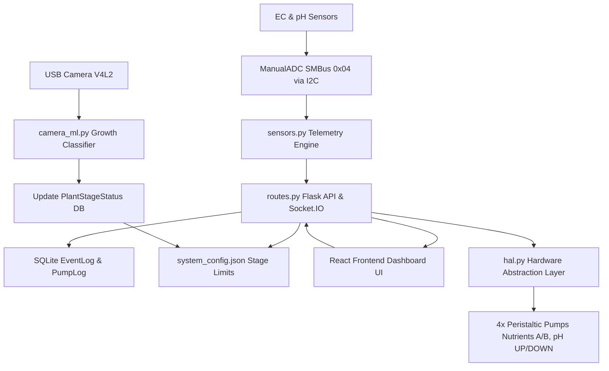

# Hydroagrix AI Dosing Controller

> Closed-loop hydroponic automation, precision sensing, computer vision crop classification, and real-time telemetry management platform engineered for Raspberry Pi / Seeed reTerminal SBC hardware.

> Detailed developer onboarding, architectural specs, and API endpoints are available in [`DOCUMENTATION.md`](file:///E:/Hydroagrix%20Ai/Ai%20Dosing%20Unit/DOCUMENTATION.md).

---

## Architecture & Data Flow

---

## Core Features

### Automation & Dosing Engine
- **Closed-Loop Automated Control**: Calculates chemical target deltas, reservoir volumes (L), and calibrated pump rates (mL/s) to dispense precise nutrient and pH adjustments.
- **Self-Calibration Feedback Loop**: Evaluates actual vs. predicted sensor deltas after mixing cooldowns to dynamically adjust pump efficacy factors.
- **Autonomous Grow Cycles**: Tracks crop timeline progression days, phase transitions, and automatic preset enforcement (Tomatoes, Lettuce, Basil, Custom).

### Sensing & Computer Vision
- **Nernst Temperature Compensation**: Multi-point piecewise linear calibration for EC and pH sensor probes with DS18B20 water temperature compensation.
- **Edge Vision Classification**: Captures USB camera frames (/dev/video0 V4L2) with HSV leaf coverage analysis and YOLO crop stage detection.
- **Real-Time Telemetry Stream**: Emits 500ms Socket.IO sensor streams (pH, EC, water temp, air temp/humidity) and live base64 camera frames.

### Safety, Monitoring & Diagnostics
- **Multi-Tiered Failsafes**: Automatic emergency halt for out-of-bound readings (pH < 3.0 or > 10.0, EC >= 8.0 mS/cm).
- **Debounced Email Alerts**: Triggers automated notifications for high EC conditions, tank depletion, and system exceptions.
- **CLI Database Diagnostics**: Native `hydro-db-check.sh` utility to inspect SQLite WAL journal status, row counts, and warning/danger event logs.

---

## Deployment Scripts & Configuration Files

- **`deploy_full.ps1`**: Full-stack PowerShell deployment runner (executes pytest suite, builds Vite frontend `dist/`, packages tarball, transfers via SCP, updates DB schemas, reloads systemd).
- **`deploy_quick.ps1`**: Fast hot-patch script for transferring modified backend modules and compiled frontend assets in seconds.
- **`hydro-db-check.sh`**: Command-line database health diagnostic script deployed to `~/hydro-db-check.sh` on target SBC hardware.
- **`start_reterminal.sh`**: Hardware environment initialization and startup wrapper script.
- **`systemd/hydro-backend.service`**: Systemd daemon configuration for the Flask/Socket.IO backend server.
- **`systemd/hydro-frontend.service`**: Systemd daemon configuration for serving the React web dashboard.

---

## Automated Test Suites

The codebase includes 221 total passing automated tests:

### Backend Pytest Suite (195 Tests)
- **HAL Hardware Layer (`test_hal.py`)**: Hardware mocks, ADC channel validation, L298N pump lock reentrancy, DS18B20 1-Wire parsing.
- **Dosing & Safety Control (`test_dosing.py`, `test_new_dosing.py`, `test_mid_dose_cutoff.py`)**: Volume calculations, runtime clamping (2s-300s), cooldown timers, mid-dose cutoffs.
- **REST APIs & Routes (`test_api.py`, `test_api_dosing.py`, `test_api_plants.py`)**: Endpoint payloads, pump priming, crop preset selection, cycle completion.
- **Grow Cycles & Persistence (`test_grow_cycle.py`, `test_models.py`, `test_new_features.py`)**: Phase duration resolution, cumulative start day inference, DB model integrity.
- **Alerts & System Stress (`test_alerts.py`, `test_performance_stress.py`)**: High-EC debouncing, email queue resilience, concurrent DB lock benchmarks.

### Frontend Vitest Suite (26 Tests)
- **UI Components (`Dashboard.test.jsx`, `GlobalHUD.test.jsx`, `QuickCameraWidget.test.jsx`)**: Gauge rendering, state badges, camera fallbacks.
- **Preset Management (`PlantPresets.test.jsx`, `PresetManagerModal.test.jsx`, `GrowCycleBanner.test.jsx`)**: Timeline visualization, form submissions, manual pump overrides.

### Test Execution Commands
- **Backend Tests**: `cd backend && python -m pytest -v --tb=short -p no:cacheprovider`
- **Frontend Tests**: `cd frontend && npm test`

---

## Technical Stack & Requirements

- **Backend**: Python 3.10+ (Flask, Flask-SocketIO, SQLAlchemy, smbus2)
- **Frontend**: Node.js v18+ (React 18, Vite, TailwindCSS, Chart.js, Socket.IO Client)
- **Hardware**: Raspberry Pi / Seeed reTerminal (Linux SBC with I2C bus enabled)
- **Process Management**: systemd

---

## Quick Setup & Commands

### Installation
- **Clone Repository**: `git clone https://github.com/CyberShadowSensei/hydroagrix-ai-dosing-controller.git`
- **Backend Setup**: `cd backend && pip install -r requirements.txt`
- **Frontend Setup**: `cd frontend && npm install`

### Runtime Commands (Target Device)
- **Restart Services**: `sudo systemctl restart hydro-backend.service hydro-frontend.service`
- **View Live Logs**: `sudo journalctl -u hydro-backend.service -f`
- **Run DB Diagnostics**: `~/hydro-db-check.sh`

---

## License & Copyright

Copyright (c) 2026 Hydroagrix AI / CyberShadowSensei. All Rights Reserved.

**PROPRIETARY AND CONFIDENTIAL.**

Unauthorized copying, reproduction, distribution, modification, sublicensing, or use of this software and associated documentation, via any medium or in any form, is strictly prohibited. See [`LICENSE`](file:///E:/Hydroagrix%20Ai/Ai%20Dosing%20Unit/LICENSE) for full legal terms.
