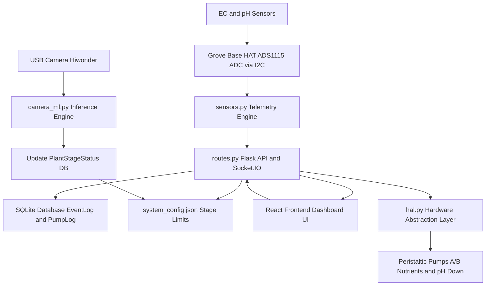

# Hydroagrix Dosing Controller

[](https://github.com/CyberShadowSensei/hydroagrix-ai-dosing-controller)

The hardware automation, sensing, and control platform for the Hydroagrix hydroponic NFT system. Executes sensor telemetry (pH/EC), runs automatic dosing logic, and serves the system control panel dashboard.

---

## System Architecture and Data Loops



---

## Core Services and Local Commands

The reTerminal runs two systemd service layers for managing the hydroponic operations:

*   **`hydro-backend.service`**: Powers the Flask API, SQLite logger, and the automated I2C dosing loops.
*   **`hydro-frontend.service`**: Serves the React UI/web dashboard.

### Management Commands on the reTerminal

*   **Restart both services:**
    ```bash
    sudo systemctl restart hydro-backend.service hydro-frontend.service
    ```
*   **Check service status:**
    ```bash
    sudo systemctl status hydro-backend.service hydro-frontend.service
    ```
*   **View live backend logs:**
    ```bash
    sudo journalctl -u hydro-backend.service -f
    ```

---

## Repository Initialization

Initialize the repository and track active development files:

```bash
git init
git add .
git commit -m "initial commit: add dosing controller backend, React frontend, and HAL scripts"
git remote add origin https://github.com/CyberShadowSensei/hydroagrix-ai-dosing-controller
git branch -M main
git push -u origin main
```
