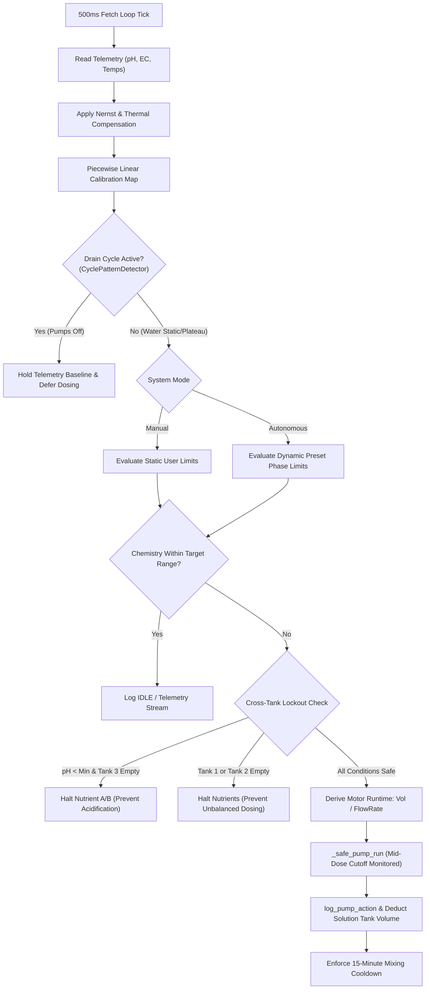

# Closed-Loop Dosing Engine Flowchart

```mermaid
flowchart TD
    START["500ms Fetch Loop Tick"] --> SENSORS["Read Telemetry (pH, EC, Temps)"]
    SENSORS --> TEMP_COMP["Apply Nernst & Thermal Compensation"]
    TEMP_COMP --> PIECEWISE["Piecewise Linear Calibration Map"]
    PIECEWISE --> DRAIN_CHECK{"Drain Cycle Active?<br/>(CyclePatternDetector)"}
    
    DRAIN_CHECK -- "Yes (Pumps Off)" --> PAUSE["Hold Telemetry Baseline & Defer Dosing"]
    DRAIN_CHECK -- "No (Water Static/Plateau)" --> MODE_CHECK{"System Mode"}
    
    MODE_CHECK -- "Manual" --> MANUAL_LIMITS["Evaluate Static User Limits"]
    MODE_CHECK -- "Autonomous" --> GROW_CYCLE["Evaluate Dynamic Preset Phase Limits"]
    
    MANUAL_LIMITS --> DOSE_DECISION{"Chemistry Within Target Range?"}
    GROW_CYCLE --> DOSE_DECISION
    
    DOSE_DECISION -- "Yes" --> IDLE["Log IDLE / Telemetry Stream"]
    DOSE_DECISION -- "No" --> CROSS_LOCK{"Cross-Tank Lockout Check"}
    
    CROSS_LOCK -- "pH < Min & Tank 3 Empty" --> LOCKOUT["Halt Nutrient A/B (Prevent Acidification)"]
    CROSS_LOCK -- "Tank 1 or Tank 2 Empty" --> PAIR_LOCK["Halt Nutrients (Prevent Unbalanced Dosing)"]
    CROSS_LOCK -- "All Conditions Safe" --> CALC_DOSE["Derive Motor Runtime: Vol / FlowRate"]
    
    CALC_DOSE --> SAFE_RUN["_safe_pump_run (Mid-Dose Cutoff Monitored)"]
    SAFE_RUN --> LOG_ACTION["log_pump_action & Deduct Solution Tank Volume"]
    LOG_ACTION --> COOLDOWN["Enforce 15-Minute Mixing Cooldown"]
```
