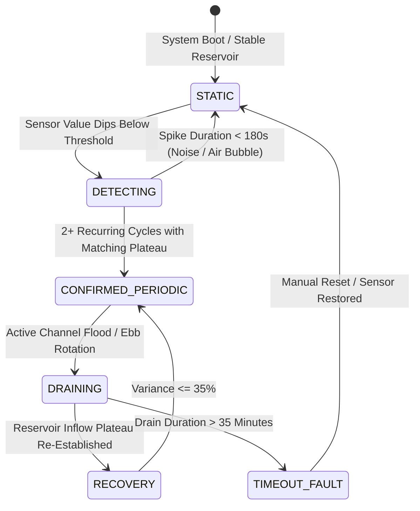

# Hydrodynamic Circulation State Machine

```mermaid
stateDiagram-v2
    [*] --> STATIC: System Boot / Stable Reservoir
    
    STATIC --> DETECTING: Sensor Value Dips Below Threshold
    
    DETECTING --> STATIC: Spike Duration < 180s (Noise / Air Bubble)
    DETECTING --> CONFIRMED_PERIODIC: 2+ Recurring Cycles with Matching Plateau
    
    CONFIRMED_PERIODIC --> DRAINING: Active Channel Flood / Ebb Rotation
    DRAINING --> RECOVERY: Reservoir Inflow Plateau Re-Established
    RECOVERY --> CONFIRMED_PERIODIC: Variance <= 35%
    
    DRAINING --> TIMEOUT_FAULT: Drain Duration > 35 Minutes
    TIMEOUT_FAULT --> STATIC: Manual Reset / Sensor Restored
```
