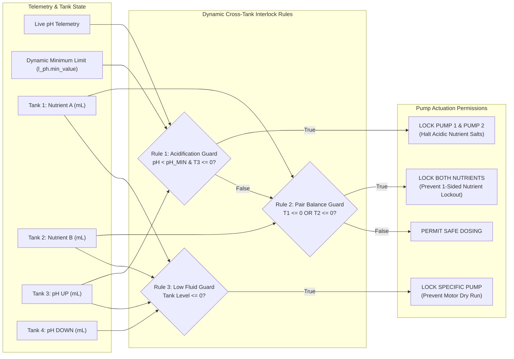

# Cross-Tank Dependency & Acidification Interlock Matrix

```mermaid
flowchart LR
    subgraph INPUTS["Telemetry & Tank State"]
        PH_VAL["Live pH Telemetry"]
        PH_MIN["Dynamic Minimum Limit (l_ph.min_value)"]
        T1["Tank 1: Nutrient A (mL)"]
        T2["Tank 2: Nutrient B (mL)"]
        T3["Tank 3: pH UP (mL)"]
        T4["Tank 4: pH DOWN (mL)"]
    end

    subgraph INTERLOCK["Dynamic Cross-Tank Interlock Rules"]
        RULE1{"Rule 1: Acidification Guard<br/>pH < pH_MIN & T3 <= 0?"}
        RULE2{"Rule 2: Pair Balance Guard<br/>T1 <= 0 OR T2 <= 0?"}
        RULE3{"Rule 3: Low Fluid Guard<br/>Tank Level <= 0?"}
    end

    subgraph ACTION["Pump Actuation Permissions"]
        BLOCK_NUTRIENTS["LOCK PUMP 1 & PUMP 2<br/>(Halt Acidic Nutrient Salts)"]
        BLOCK_PAIR["LOCK BOTH NUTRIENTS<br/>(Prevent 1-Sided Nutrient Lockout)"]
        BLOCK_PUMP["LOCK SPECIFIC PUMP<br/>(Prevent Motor Dry Run)"]
        ALLOW["PERMIT SAFE DOSING"]
    end

    PH_VAL & PH_MIN & T3 --> RULE1
    T1 & T2 --> RULE2
    T1 & T2 & T3 & T4 --> RULE3

    RULE1 -- "True" --> BLOCK_NUTRIENTS
    RULE1 -- "False" --> RULE2
    RULE2 -- "True" --> BLOCK_PAIR
    RULE2 -- "False" --> ALLOW
    RULE3 -- "True" --> BLOCK_PUMP
```
