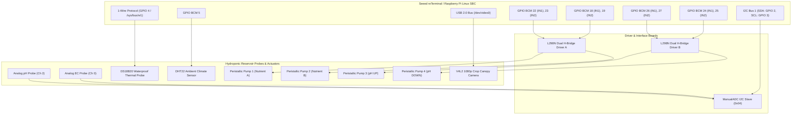

# Hardware Pinout & Edge Bus Topology

```mermaid
graph TD
    subgraph SBC ["Seeed reTerminal / Raspberry Pi Linux SBC"]
        I2C["I2C Bus 1 (SDA: GPIO 2, SCL: GPIO 3)"]
        ONE_WIRE["1-Wire Protocol (GPIO 4 / /sys/bus/w1)"]
        DHT_PIN["GPIO BCM 5"]
        P1_PINS["GPIO BCM 18 (IN1), 19 (IN2)"]
        P2_PINS["GPIO BCM 22 (IN1), 23 (IN2)"]
        P3_PINS["GPIO BCM 24 (IN1), 25 (IN2)"]
        P4_PINS["GPIO BCM 26 (IN1), 27 (IN2)"]
        USB["USB 2.0 Bus (/dev/video0)"]
    end

    subgraph DRIVERS ["Driver & Interface Boards"]
        ADC_BOARD["ManualADC I2C Slave (0x04)"]
        L298N_1["L298N Dual H-Bridge Driver A"]
        L298N_2["L298N Dual H-Bridge Driver B"]
    end

    subgraph FIELD_DEVICES ["Hydroponic Reservoir Probes & Actuators"]
        EC_PROBE["Analog EC Probe (Ch 0)"]
        PH_PROBE["Analog pH Probe (Ch 2)"]
        TEMP_PROBE["DS18B20 Waterproof Thermal Probe"]
        AIR_SENSOR["DHT22 Ambient Climate Sensor"]
        PUMP_1["Peristaltic Pump 1 (Nutrient A)"]
        PUMP_2["Peristaltic Pump 2 (Nutrient B)"]
        PUMP_3["Peristaltic Pump 3 (pH UP)"]
        PUMP_4["Peristaltic Pump 4 (pH DOWN)"]
        CAMERA["V4L2 1080p Crop Canopy Camera"]
    end

    I2C --> ADC_BOARD
    EC_PROBE & PH_PROBE --> ADC_BOARD
    ONE_WIRE --> TEMP_PROBE
    DHT_PIN --> AIR_SENSOR
    P1_PINS & P2_PINS --> L298N_1
    P3_PINS & P4_PINS --> L298N_2
    L298N_1 --> PUMP_1 & PUMP_2
    L298N_2 --> PUMP_3 & PUMP_4
    USB --> CAMERA
```
