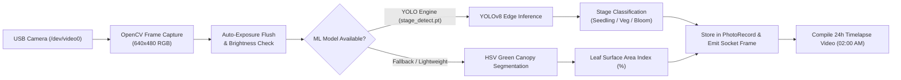

# Edge Vision & Crop Canopy Classification Pipeline

```mermaid
flowchart LR
    CAM["USB Camera (/dev/video0)"] --> CAPTURE["OpenCV Frame Capture
(640x480 RGB)"]
    CAPTURE --> PREPROCESS["Auto-Exposure Flush
& Brightness Check"]
    
    PREPROCESS --> FORK{"ML Model Available?"}
    
    FORK -- "YOLO Engine (stage_detect.pt)" --> YOLO["YOLOv8 Edge Inference"]
    FORK -- "Fallback / Lightweight" --> HSV["HSV Green Canopy Segmentation"]
    
    YOLO --> STAGE_OUT["Stage Classification
(Seedling / Veg / Bloom)"]
    HSV --> COVERAGE["Leaf Surface Area Index (%)"]
    
    STAGE_OUT & COVERAGE --> STORE["Store in PhotoRecord & Emit Socket Frame"]
    STORE --> DIGEST["Compile 24h Timelapse Video (02:00 AM)"]
```
