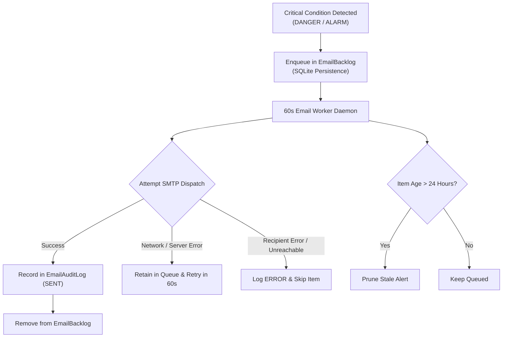

# Email Alert Backlog & Exponential Backoff Architecture

```mermaid
flowchart TD
    ALERT["Critical Condition Detected
(DANGER / ALARM)"] --> QUEUE["Enqueue in EmailBacklog
(SQLite Persistence)"]
    
    QUEUE --> DAEMON["60s Email Worker Daemon"]
    DAEMON --> SMTP{"Attempt SMTP Dispatch"}
    
    SMTP -- "Success" --> AUDIT["Record in EmailAuditLog (SENT)"]
    AUDIT --> DELETE["Remove from EmailBacklog"]
    
    SMTP -- "Network / Server Error" --> RETRY["Retain in Queue & Retry in 60s"]
    SMTP -- "Recipient Error / Unreachable" --> SKIP["Log ERROR & Skip Item"]
    
    DAEMON --> PRUNE{"Item Age > 24 Hours?"}
    PRUNE -- "Yes" --> DISCARD["Prune Stale Alert"]
    PRUNE -- "No" --> RETAIN["Keep Queued"]
```
