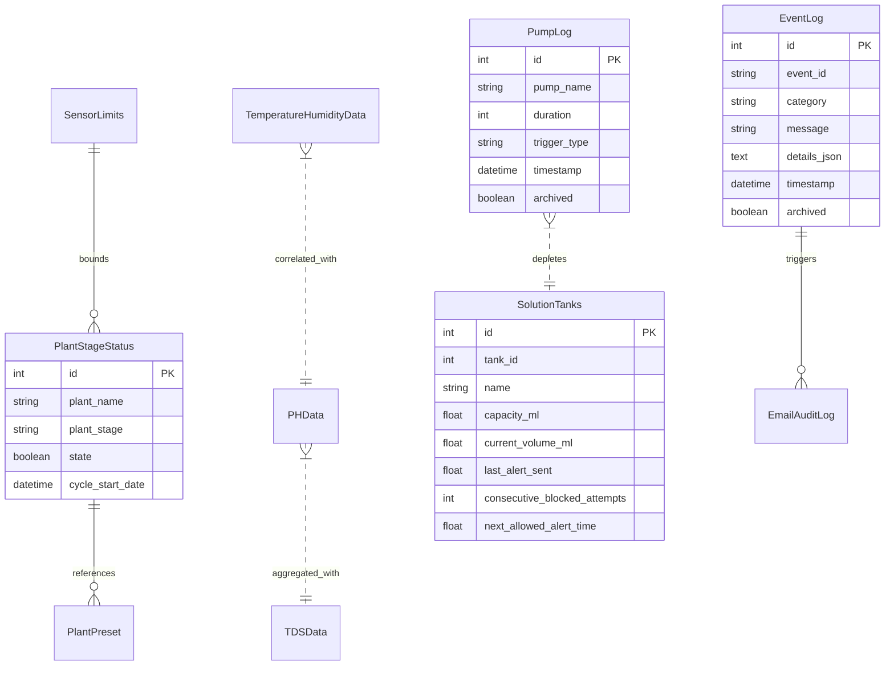

# Database Entity-Relationship Diagram (SQLite WAL)

```mermaid
erDiagram
    PlantStageStatus ||--o{ PlantPreset : references
    SensorLimits ||--o{ PlantStageStatus : bounds
    PHData }|..|| TDSData : aggregated_with
    TemperatureHumidityData }|..|| PHData : correlated_with
    PumpLog }|..|| SolutionTanks : depletes
    EventLog ||--o{ EmailAuditLog : triggers

    PlantStageStatus {
        int id PK
        string plant_name
        string plant_stage
        boolean state
        datetime cycle_start_date
    }
    SolutionTanks {
        int id PK
        int tank_id
        string name
        float capacity_ml
        float current_volume_ml
        float last_alert_sent
        int consecutive_blocked_attempts
        float next_allowed_alert_time
    }
    PumpLog {
        int id PK
        string pump_name
        int duration
        string trigger_type
        datetime timestamp
        boolean archived
    }
    EventLog {
        int id PK
        string event_id
        string category
        string message
        text details_json
        datetime timestamp
        boolean archived
    }
```
