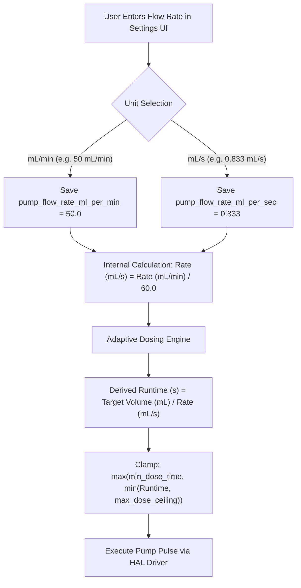

# Universal Motor Flow Rate & Runtime Derivation

```mermaid
flowchart TD
    USER_INPUT["User Enters Flow Rate in Settings UI"] --> UNIT_SWITCH{"Unit Selection"}
    
    UNIT_SWITCH -- "mL/min (e.g. 50 mL/min)" --> SYNC_MIN["Save pump_flow_rate_ml_per_min = 50.0"]
    UNIT_SWITCH -- "mL/s (e.g. 0.833 mL/s)" --> SYNC_SEC["Save pump_flow_rate_ml_per_sec = 0.833"]
    
    SYNC_MIN --> CONVERT["Internal Calculation: Rate (mL/s) = Rate (mL/min) / 60.0"]
    SYNC_SEC --> CONVERT
    
    CONVERT --> DOSING_ENGINE["Adaptive Dosing Engine"]
    DOSING_ENGINE --> DERIVE["Derived Runtime (s) = Target Volume (mL) / Rate (mL/s)"]
    
    DERIVE --> CLAMP["Clamp: max(min_dose_time, min(Runtime, max_dose_ceiling))"]
    CLAMP --> SAFE_EXEC["Execute Pump Pulse via HAL Driver"]
```
