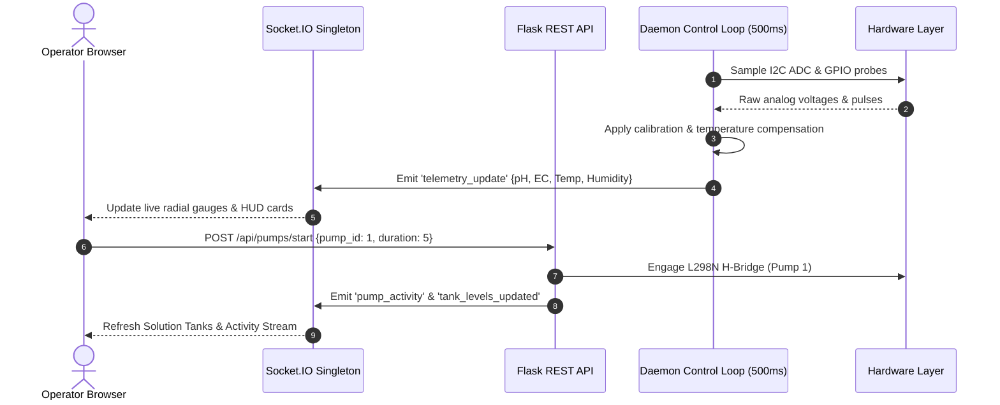

# Real-Time WebSocket & REST Telemetry Flow

```mermaid
sequenceDiagram
    autonumber
    actor User as Operator Browser
    participant WS as Socket.IO Singleton
    participant REST as Flask REST API
    participant Engine as Daemon Control Loop (500ms)
    participant HAL as Hardware Layer

    Engine->>HAL: Sample I2C ADC & GPIO probes
    HAL-->>Engine: Raw analog voltages & pulses
    Engine->>Engine: Apply calibration & temperature compensation
    Engine->>WS: Emit 'telemetry_update' {pH, EC, Temp, Humidity}
    WS-->>User: Update live radial gauges & HUD cards
    
    User->>REST: POST /api/pumps/start {pump_id: 1, duration: 5}
    REST->>HAL: Engage L298N H-Bridge (Pump 1)
    REST->>WS: Emit 'pump_activity' & 'tank_levels_updated'
    WS-->>User: Refresh Solution Tanks & Activity Stream
```
