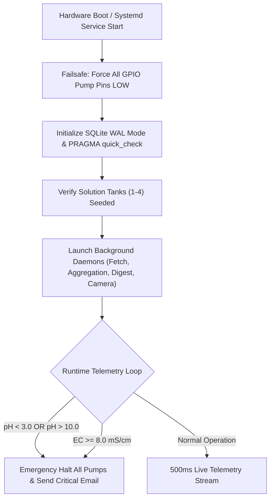

# System Lifecycle & Failsafe Watchdog

```mermaid
flowchart TB
    BOOT["Hardware Boot / Systemd Service Start"] --> PINS_LOW["Failsafe: Force All GPIO Pump Pins LOW"]
    PINS_LOW --> INIT_DB["Initialize SQLite WAL Mode & PRAGMA quick_check"]
    INIT_DB --> SEED_TANKS["Verify Solution Tanks (1-4) Seeded"]
    SEED_TANKS --> START_THREADS["Launch Background Daemons (Fetch, Aggregation, Digest, Camera)"]
    
    START_THREADS --> MONITOR{"Runtime Telemetry Loop"}
    
    MONITOR -- "pH < 3.0 OR pH > 10.0" --> CRITICAL_HALT["Emergency Halt All Pumps & Send Critical Email"]
    MONITOR -- "EC >= 8.0 mS/cm" --> CRITICAL_HALT
    MONITOR -- "Normal Operation" --> TELEMETRY["500ms Live Telemetry Stream"]
```
